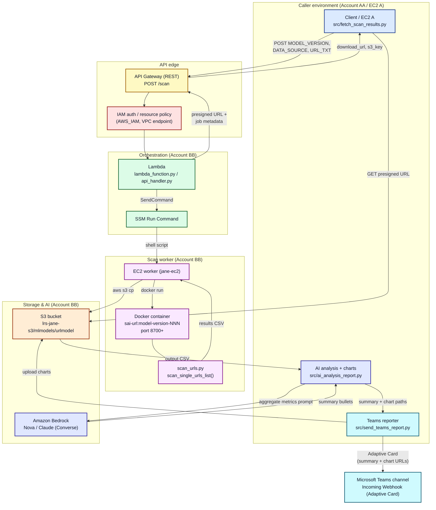
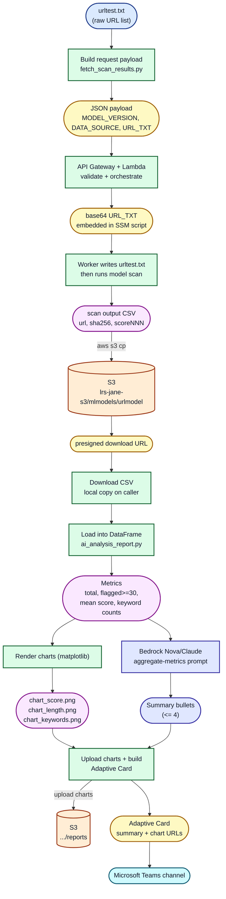

# ai-urlmodel-secure-orchestrator

`ai-urlmodel-secure-orchestrator` is a secure **AI-supported** API orchestration project for URL model scanning workflows on AWS.

It provides a reference structure for:
- receiving scan requests through API Gateway
- orchestrating scanning with a trained machine-learning model on a worker (for example EC2 via SSM or ECS)
- storing results in S3
- analyzing results and generating summaries/charts with Bedrock-supported AI models (for example Nova or Claude)
- preparing outputs for dashboard/reporting use
- delivering the AI-supported report to a Microsoft Teams channel

## What This Project Does

- Exposes a REST-style scan entrypoint.
- Validates input fields such as `MODEL_VERSION`, `DATA_SOURCE`, and URL text payload.
- Submits scanning work to backend execution (containerized URL model).
- Writes scan artifacts (CSV/charts) to storage.
- Produces concise, defensive-oriented summaries for reporting.
- Sends the final AI-supported report (summary + charts) to Microsoft Teams.

## System Architecture



A full-page version with a color legend is in `docs/architecture-diagram.md`.

## Data Workflow



A stage-by-stage explanation with a color legend is in `docs/data-workflow.md`.

## Project Structure

```text
ai-urlmodel-secure-orchestrator/
├── README.md
├── LICENSE
├── .gitignore
├── requirements.txt
├── api_handler.py
├── ecs_runner.py
├── lambda_function.py
├── src/
│   ├── __init__.py
│   ├── app.py
│   ├── fetch_scan_results.py
│   ├── ai_analysis_report.py
│   ├── send_teams_report.py
│   └── schemas.py
├── tests/
│   └── test_schemas.py
└── docs/
    ├── architecture.md
    ├── architecture-diagram.md
    ├── api.md
    ├── design.md
    ├── dataflow.md
    ├── data-workflow.md
    ├── webconsole-deployment.md
    └── teams-reporting.md
```

## How to Use

### 1) Clone and enter project

```bash
git clone https://github.com/juanchencs/ai-urlmodel-secure-orchestrator.git
cd ai-urlmodel-secure-orchestrator
```

### 2) Create Python environment

```bash
python3 -m venv .venv
source .venv/bin/activate
pip install -U pip
pip install -r requirements.txt
```

### 3) Run local schema validation demo

```bash
python src/app.py
```

### 4) Run tests

```bash
python -m unittest discover -s tests -p "test_*.py"
```

### 5) Fetch scan result CSV (split from old test_io flow)

```bash
python src/fetch_scan_results.py \
  --api-url "https://fi0d5laq4a.execute-api.eu-west-2.amazonaws.com/prod/scan" \
  --model-version "20250301" \
  --data-source "VT" \
  --url-file "urltest.txt"
```

### 6) Generate AI-assisted analysis + charts from CSV

```bash
python src/ai_analysis_report.py \
  --csv-file "VT_20250301_63.csv" \
  --region "eu-west-2" \
  --nova-model-id "amazon.nova-lite-v1:0" \
  --output-dir "."
```

### 7) Send the AI-supported report to Microsoft Teams (final step)

Deliver as part of the analysis step by adding `--teams-webhook`:

```bash
python src/ai_analysis_report.py \
  --csv-file "VT_20250301_63.csv" \
  --region "eu-west-2" \
  --nova-model-id "amazon.nova-lite-v1:0" \
  --output-dir "." \
  --teams-webhook "https://prod-XXX.logic.azure.com:443/workflows/.../invoke?..."
```

Or run the Teams delivery on its own from an existing summary and charts:

```bash
python src/send_teams_report.py \
  --webhook-url "https://prod-XXX.logic.azure.com:443/workflows/.../invoke?..." \
  --summary-file "summary.txt" \
  --bucket "lrs-jane-s3" \
  --prefix "mlmodels/urlmodel/reports"
```

## Examples

### Example request payload

```json
{
  "MODEL_VERSION": "20250301",
  "DATA_SOURCE": "VT",
  "URL_TXT": "https://example.com\nhttps://example.org"
}
```

### Example validation output

```text
Payload accepted.
Model version: 20250301
Data source: VT
URL count: 2
```

## Documentation

- Architecture: `docs/architecture.md`
- Architecture diagram (colored): `docs/architecture-diagram.md`
- API contract: `docs/api.md`
- Design details: `docs/design.md`
- End-to-end dataflow: `docs/dataflow.md`
- Data workflow diagram (colored): `docs/data-workflow.md`
- Web Console deployment (IAM role, Lambda, API Gateway, policies): `docs/webconsole-deployment.md`
- Microsoft Teams reporting (final step): `docs/teams-reporting.md`
