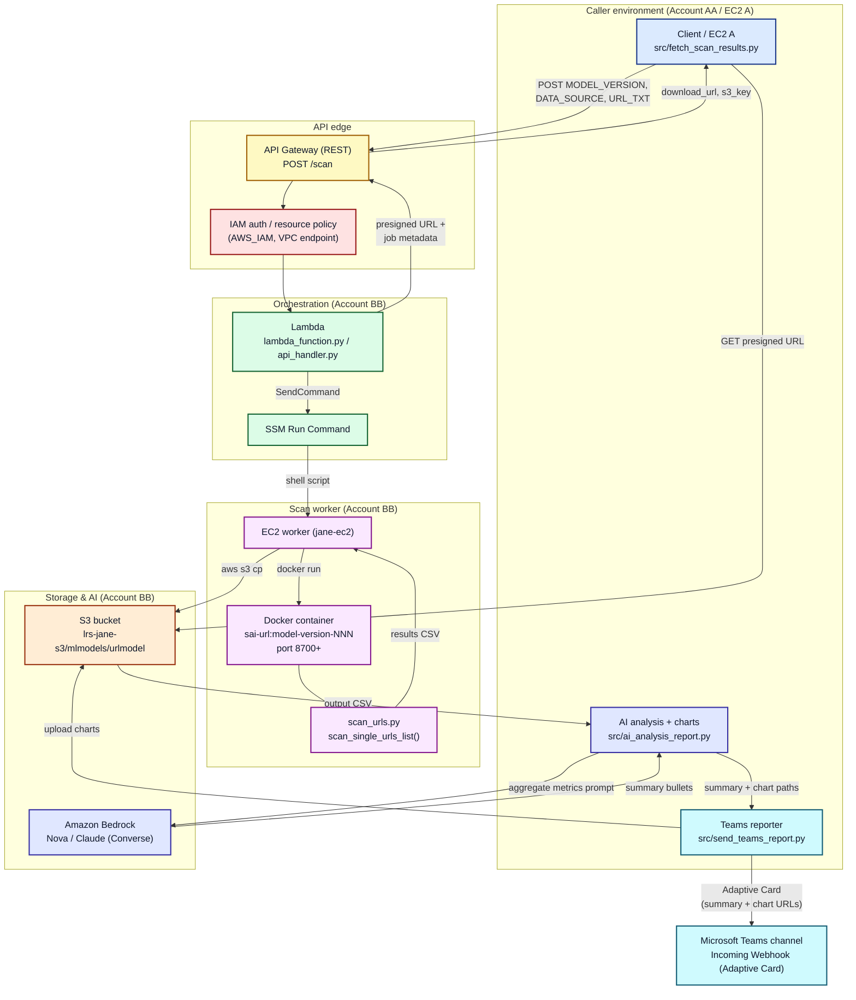

# System Architecture Diagram

The diagram below shows the end-to-end flow of `ai-urlmodel-secure-orchestrator`,
from the API request through scanning, AI analysis, and Microsoft Teams delivery.

It is written in Mermaid, which renders as a colored diagram directly on GitHub.

## Legend

- Blue: caller/client components
- Indigo: AI components (Bedrock Nova/Claude + analysis)
- Yellow: API Gateway edge
- Red: security controls (IAM auth, resource policy, VPC endpoint)
- Green: orchestration (Lambda + SSM)
- Purple: scan worker (EC2 + Docker + scanner)
- Orange: S3 storage
- Cyan: Microsoft Teams reporting

## Notes

- The caller and backend may live in different AWS accounts (AA and BB); a
  shared IAM principal with access to S3, Lambda, and Bedrock in BB is used.
- The worker uses dynamic container name/port selection starting at `8700` to
  avoid conflicts.
- Charts are uploaded to S3 and referenced via presigned URLs because Microsoft
  Teams cannot render local files.
