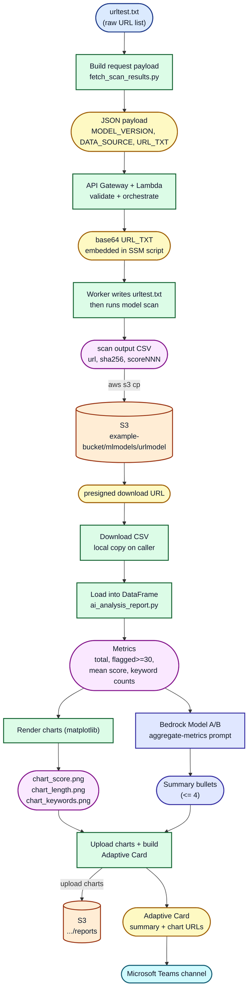

# Data Workflow

This diagram focuses on how **data** is transformed and moved through the
pipeline, from the raw URL list to the final Microsoft Teams report. It is
written in Mermaid and renders as a colored diagram on GitHub.

Shapes:
- Rounded boxes = data artifacts (files, payloads, objects)
- Rectangles = processing steps
- Cylinders = persistent storage

## Stage-by-Stage

1. **Raw input**: `urltest.txt` holds one URL per line.
2. **Request payload**: packaged into JSON with `MODEL_VERSION`, `DATA_SOURCE`, `URL_TXT`.
3. **Orchestration**: API Gateway + Lambda validate and embed the URL text
   (base64) into an SSM shell script.
4. **Scan**: the worker recreates `urltest.txt`, runs the model container, and
   produces a CSV with columns like `url`, `sha256`, and `scoreNNN`.
5. **Persistence**: CSV is uploaded to S3; a presigned URL is returned.
6. **Local load**: the caller downloads the CSV and loads it into a DataFrame.
7. **Metrics**: totals, flagged count (`score >= 30`), mean score, and keyword
   frequencies are computed.
8. **Charts**: three PNG charts are rendered.
9. **AI summary**: Bedrock (Model A/B) produces up to 4 bullet points from the
   aggregate metrics only.
10. **Report delivery**: charts are uploaded to S3, an Adaptive Card is built
    (summary + chart URLs), and posted to the Microsoft Teams channel.

## Color Legend

- Blue: raw input
- Yellow: payloads / transport artifacts
- Green: processing steps
- Purple: derived data artifacts
- Indigo: AI (Bedrock) steps and outputs
- Orange: S3 storage
- Cyan: final Teams output
